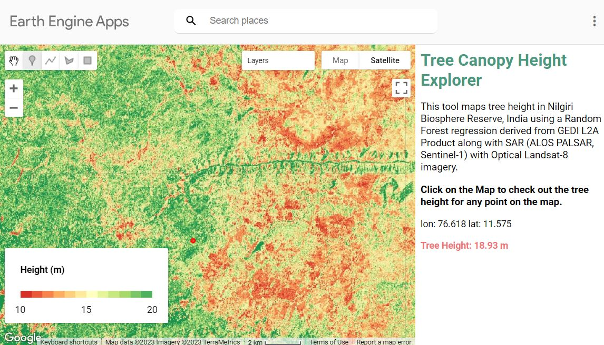

# Tree-Height-Map-NBR

Prepare 30m resolution tree-height map for Nilgiri Bioshphere Reserve using Google Earth Engine. Uses GEDI, Landsat-8, ALOS-PALSAR, Sentinel-1 data products.

# Final App Link

[https://ankurshringi.users.earthengine.app/view/tree-height-map-nbr](https://ankurshringi.users.earthengine.app/view/tree-height-map-nbr)

# Disclaimer

* Project is a proof of conecpt in nature, and that entire workflow of such calculations can be implemented in Google Earth Engine. 

* Tree-height values reported in the app differ from the real values, validation of which was outside the scope of this project due to the internship time-constraints.

# Credits

* The project is the part of the internship of [Nav-i-GEE ]([Nav-i-GEE](https://iittnif.com/nav-i-gee))project, a summer of google code internship equivalent program for 2023.

* The host orgnisation is National Centre for Biological Sciences (NCBS) with Mentors Dr. M. D. Madhusudan, Pradeep Koulgi, Dr. Mahesh Sankarn
